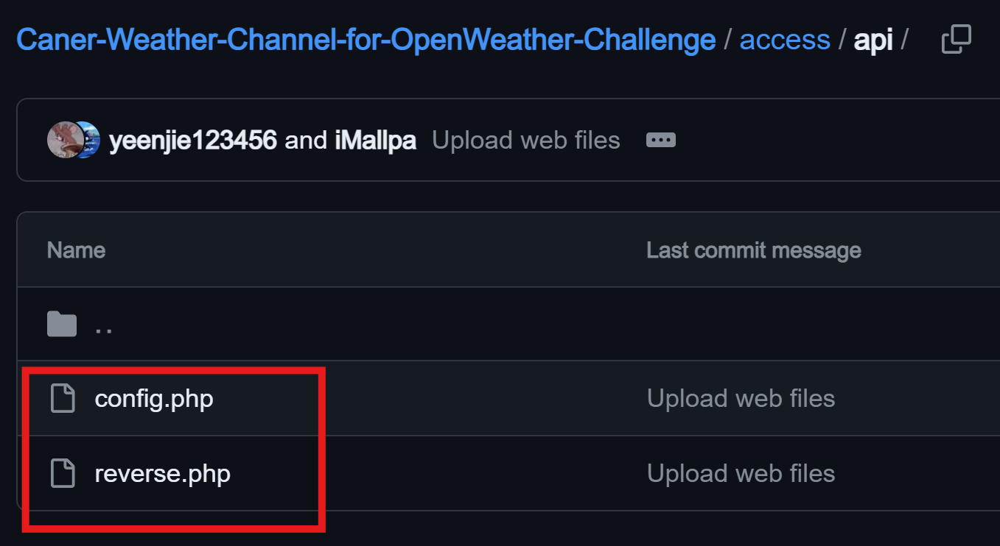

# Caner Weather Channel for OpenWeather Challenge
### OpenWeather Challenge Entries

**Prepared by:** Caner Developer Team

This is a special explanation document crafted for the OpenWeather Challenge.

- **Website:** [weather.caner.center](https://weather.caner.center)
- **GitHub:** [Caner-HK/Caner-Weather-Channel-for-OpenWeather-Challenge](https://github.com/Caner-HK/Caner-Weather-Channel-for-OpenWeather-Challenge)
- **Document:** [Google Docs](https://docs.google.com/document/d/1Omq9M9pxbSq4jJ8RSzh1YiWLEayRemKlIbymoCggsrA/edit?usp=drivesdk)

---
# IMPORTANT

### You MUST fill in ALL necessary cloud services' API keys into the following 2 files shown in the screenshot before you deploy this project.

---

## Project Overview
**Caner Weather Channel (CWC)** is innovatively designed by the Caner Developer Team. We use **PHP** for backend operations, **CSS** for styling, and **JavaScript** for dynamic features such as rich maps and data displays. Our platform support includes Android apps in **Kotlin**, iOS and macOS apps in **Swift**, and Windows and Linux apps in **Python**.

CWC's goal is not merely to provide weather information but to influence daily decisions through AI-driven advice, such as recommending environmentally friendly travel options or the optimal times to reduce energy usage.

## Technical Architecture
### Backend PHP Logic
1. **API Key Management**: Use `define()` to store and `require` to integrate API keys.
2. **User Location Detection**: Utilize **IPinfo's** service to ascertain user's IP-based location.
3. **User Data Handling**: Employ `$_SERVER` to retrieve browser language and user agent.
4. **User Preferences**: Fetch user settings from **CWC-Profile** cookie in JSON format.
5. **Data Storage**: Store user requests and IDs in the database using cookies.
6. **Language Selection**: Automatically select the language based on the browser's `Accept-Language.`
7. **Geolocation**: Determine user's latitude and longitude using **Google Geocode** service.
8. **Preferences and Settings**: Manage units and map preferences from **CWC-Profile** cookie.
9. **Weather API Interaction**: Connect to **OpenWeather API** for real-time data.
10. **Feature Configuration**: Toggle Google Analytics and accessibility features based on user settings.

### JavaScript Enhancements
1. **Geolocation Adjustment**: Correct location detection when discrepancies occur.
2. **Map Rendering**: Implement Google Maps and Chart.js for interactive weather visualizations.
3. **AJAX for Weather Advice**: Use AJAX to fetch weather advice dynamically.
4. **Interactive Map Features**: Enable users to interact with the map for weather details and radar.

## Key Features
- **Multilingual Capability**: Supports multiple languages to enhance user accessibility.
- **Customization of Units**: Users can set their preferences for temperature, wind speed, and more.
- **Interactive Maps**: Feature-rich maps that provide weather summaries and radar overlays.
- **Accessibility Features**: Includes a mode for enhanced visual focus and audio feedback for the visually impaired.
- **Weather Alerts**: Offers enhanced alerts for severe weather conditions to ensure user safety.
- **Weather Advice**: Leverages the advanced capabilities of GPT-4 for tailored weather recommendations.

## Future Development Prospects
CWC was launched on **November 24, 2023** and remains a priority for the Caner Developer Team. Plans include integrating advanced functionalities like personal weather stations, solar energy assessments, and agricultural analytics.

## Statement
**You MUST adhere to the terms of the _GNU Affero General Public License - 3.0_ when using CWC in any form, as it serves as the foundational license for this project.**

Additional terms and conditions may also apply.

The source code for CWC is publicly available for research and usage on our [website](https://weather.caner.center) and GitHub. We are committed to transparency and open collaboration.

Caner's signature is required to be retained as per usage terms.
